# Stock Price Prediction Based On Time Series Baseline, Holt-Winter, and Autoregressive-Moving Average Models

The project aims to build Univariate models to forecast NASDAQ stock index’s price using Python programming language. The data and its source are first introduced and the need for such tool is explored. The data is then processed in order to keep 5500 datapoints, converted to the appropriate data types, the target variable is set as the close stock price and then split into 1:5 testing to training datapoints. The data is then is made stationary by differencing the log of the data. Through time decomposition, it is determined that the data has a strong trend and weak seasonality. 

The data is then modeled using Average, Naïve, Simple Exponential Smoothening, Holt’s linear, Holt-Winter Seasonal, ARMA and ARIMA methods. At the end of experimenting with each model, the best one-step forecast is determined to be Holt Linear method and the best h-step predictor is ARIMA with order (3,1,4).

The data is obtained from http://macrotrends.net/ and it consists of the daily market closing, market opening, highest and lowest price of the day and the volume of shares traded on the day. The target will be to predict the closing price of IXIC. The first datapoint is taken dated “2002-07-01” and the last is “2020-11-27” (format = Year-month-day). 80% of the data will be used as a model training dataset (2002-07-01 – 2017-03-23) and 20% of the data will bused as a testing dataset for the trained models (2017-03-24 – 2020-11-27) .

## NASDAQ - Original Data (Train Set)

ARMA methods require data to be made stationary in as the AR (auto-regressive portion of the model) is a linear method that uses its previous lags in modelling the data. This can be investigated by:

<ul>
    <li>Calculating the augmented Dickey–Fuller test (ADF) which tests if a unit root is present in the dataset The null and alternative hypothesis tests state that:</li>
        <ul>
            <li>H0: If failed to be rejected, it suggests the time-series has a unit root, meaning it is non-stationary. Assuming confidence of 95%, p-value >= 0.05.</li>
            <li>H1: The null hypothesis is rejected, it suggests the time-series do not have a unit root, meaning it is stationary. (p-value < 0.05)</li>
        </ul>
    <li>Proving the data to be normally distributed. This can be demonstrated using a histogram plot.</li>
    <li>Showing weak auto-correlation at time lags 1 and above. This can be demonstrated using an autocorrelation stem plot.</li>
</ul>

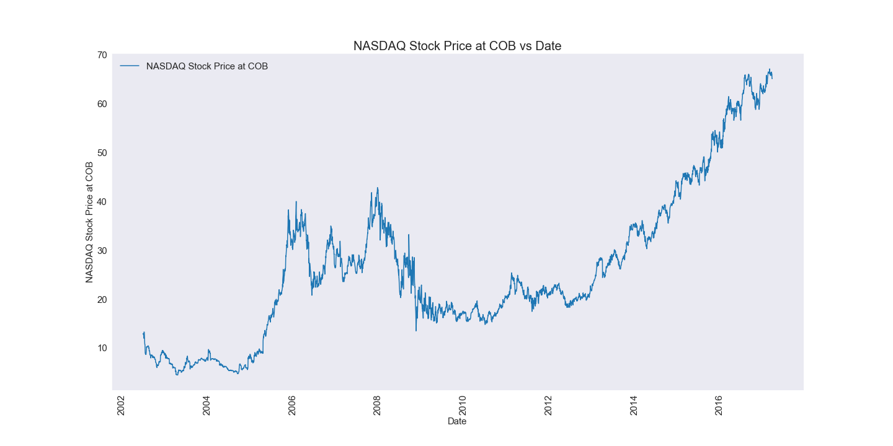

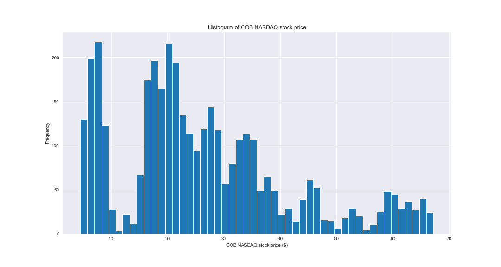

The skewed nature of the histogram, confirms that the data is not normally distributed. This reinforces the findings of the ADF test that the data is non-stationary. 

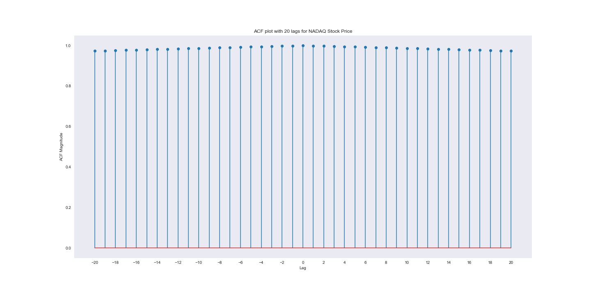

The ACF plot shows a strong linear relationship between lagged values. Taking all of the above evidence into consideration, the data is considered not stationary and further processing operations will be implemented to achieve stationarity. 

ADF Statistic: 0.2751 
p-value: 0.9761 

p-value > 0.05, we fail to reject H0. Thus data is not stationary according to ADF test. 

## NASDAQ - Differenced Log of Data

The data will be transformed using log transformation followed by first order differencing to achieve stationarity*. Pandas differencing .diff() mehod is applied and a new column is created in the training dataframe.

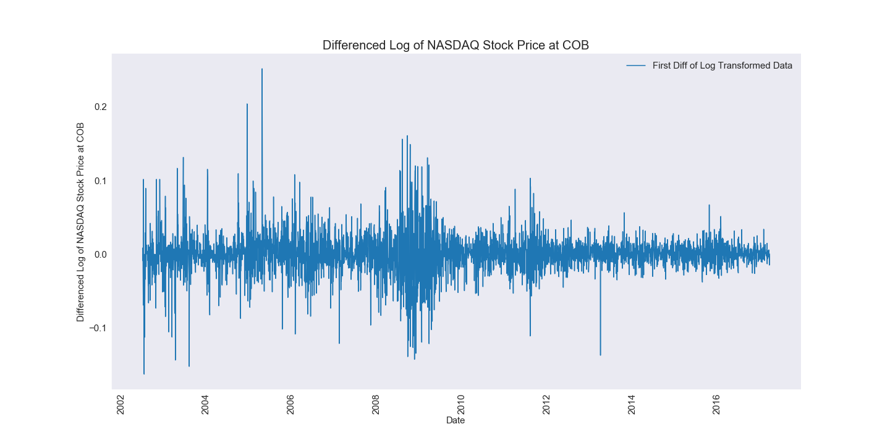

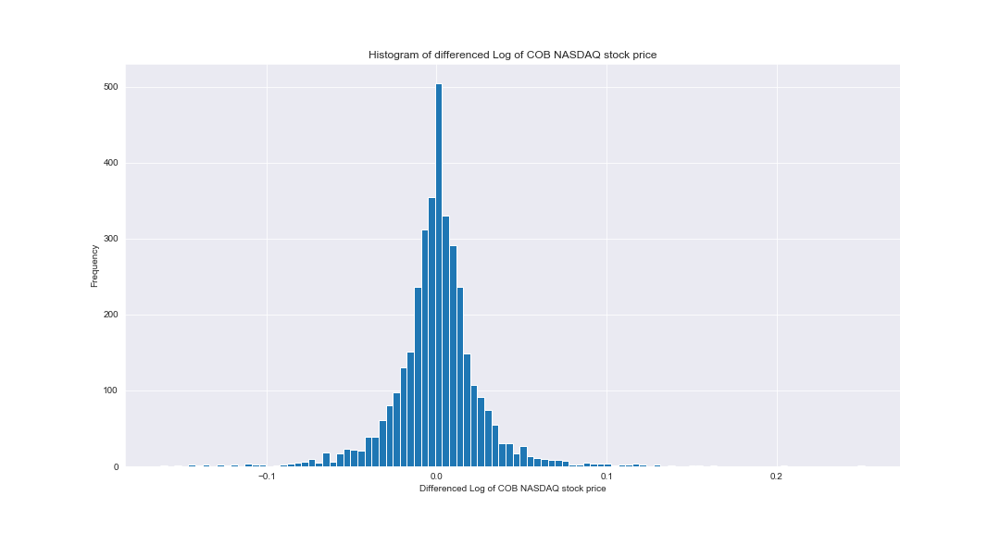

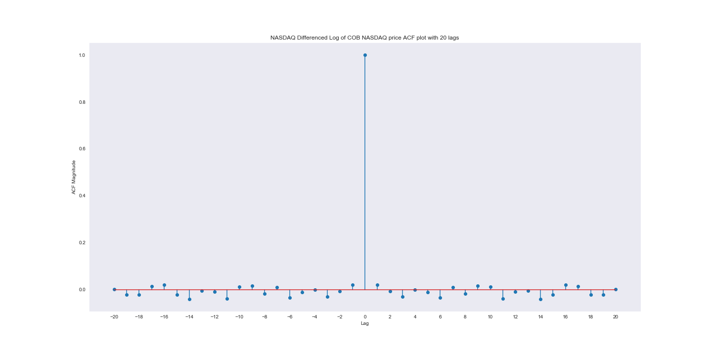

The ACF plot shows the first order differencing of Log of data has eliminated the strong linear relationship between lagged values. The PACF and ACF plots using statsmodels library show the shaded blue area which is the confidence intervals where the standard deviation is computed according to Bartlett’s formula. The plotted stems that protrude beyond the shaded area are indicators for the orders that can be used when fitting autoregressive (AR) and moving-average (MA) models. ACF plot can help determine the order of MA- here the plot shows that orders 3 and 6 may be used. The PACF plot helps determine the order of AR, which could also shows them to be at lags 3 and 6. More on this is explored later in section 6, where ARMA and ARIMA models are used. 

ADF Statistic: -18.3238 
p-value: 2.2630585806598424e-30 

P-value is << 0.05; hence We reject H0 and adopt H1. The ADF test indicates data is stationary. 

## NASDAQ - Time Decomposition

ARIMA and SARIMA are extensions of ARMA method and are used for data that has a strong trend, seasonality or both. Time decompostion is used to approximate the strengths of these in time series data. 

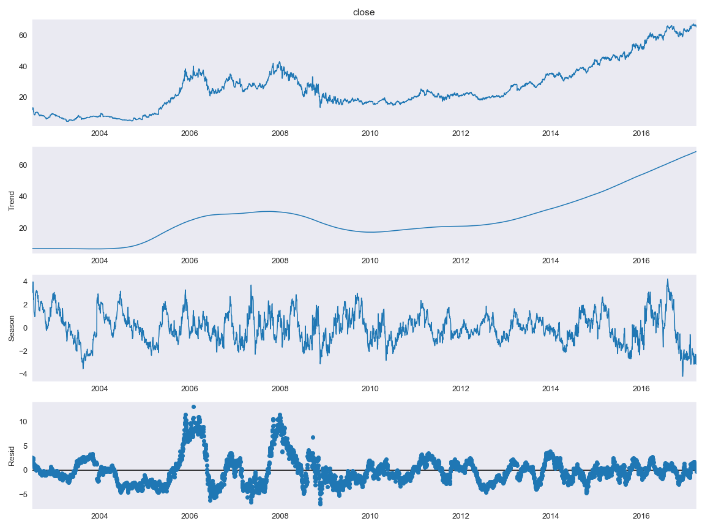

FS is 0.206 which is a low seasonality, as such seasonality is of a lower impact on the modelling methods used. On the otherhand, FT is 0.97 which means the data exhibits very strong trend. The results indicate that ARMA and ARIMA may be sufficent to model this data. 

## NASDAQ Baseline Models

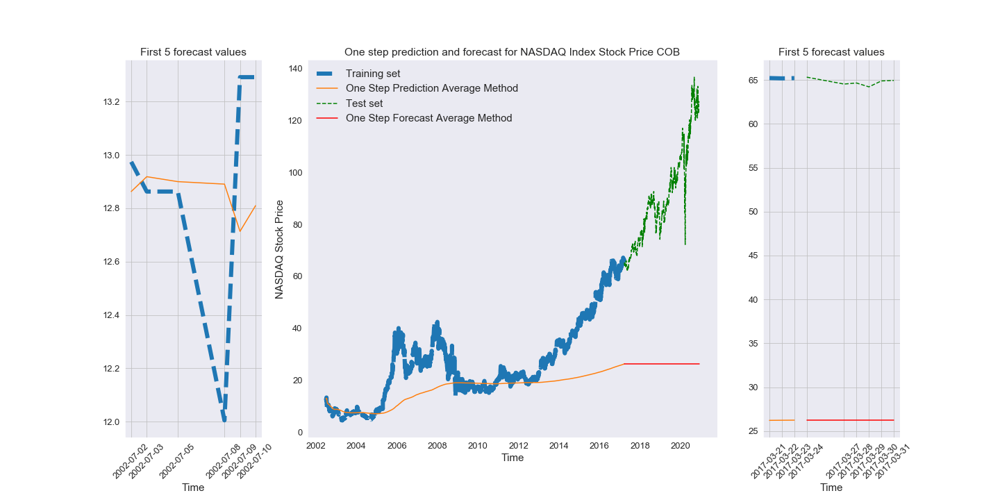
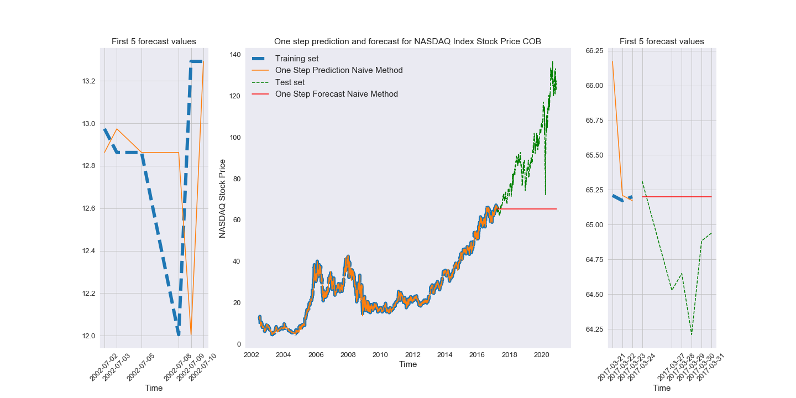
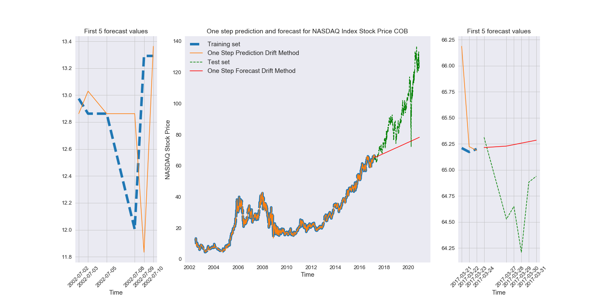
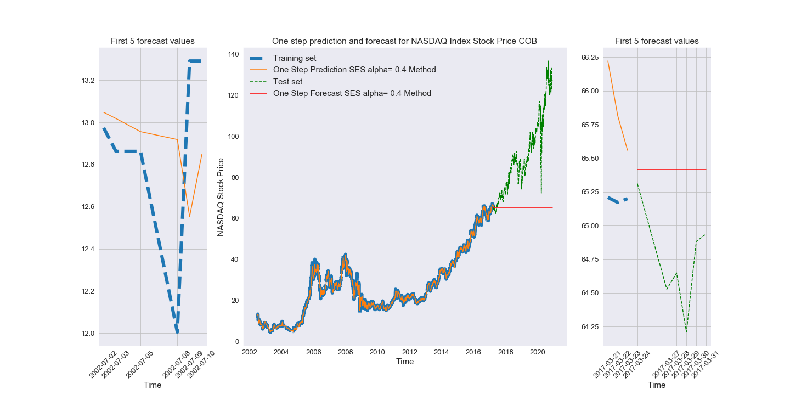
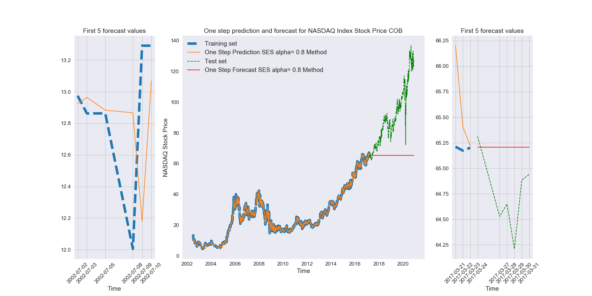

## Holt Linear and Holt-Winter Seasonal Methods

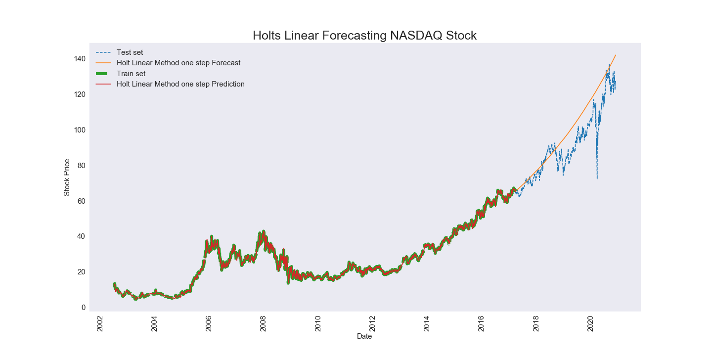
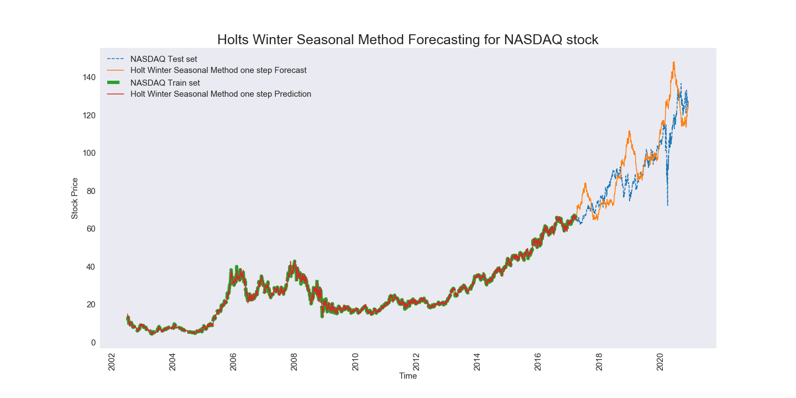

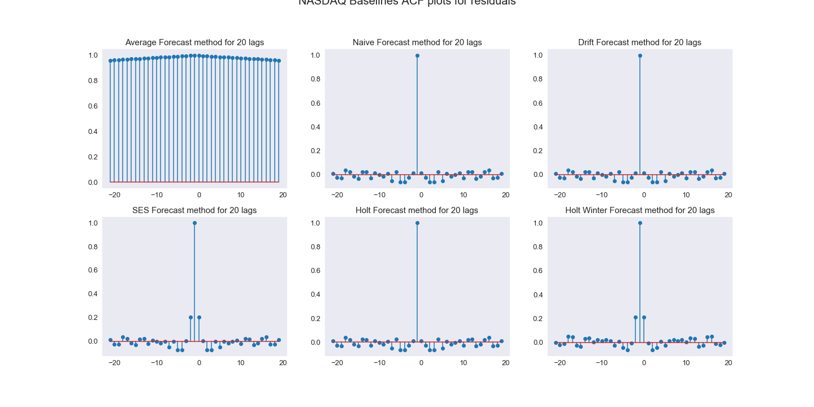

In an ideal model, the residuals should classify as White Noise WN; this is defined as a squence of random numbers that cannot be predicted that has mean of zero, constant variance and a normal distribution. When that is the case, the model is considered to have perfectly captured the information in the data and no further improvements can be done to it. Another property of WN is that the ACF plot for WN has a peak equal to one at lag 0 and absolute zero for all other values. The ACF plot of the residuals for all models except average method drop to values below 0.2 after the first lag and keep on decaying at further lags. This indicates the residuals have an ACF distriubtion that is close to being White Noise The degree to which residuals represent WN can be measured by calculating the Box-Pierce test's Q value and compare it to Chi-Square test. The hypothesis for the test is: 
- H0: Null hypothesis: The residuals are uncorrelated, hence it is white. This can be shown when Q < Qc or when the p-value is higher than the threshold. 
- HA Alternative hypothesis: The residuals are correlated, hence it is NOT white. This can be shown when Q > Qc or when the p-value is lower than the threshold.  

Furthermore, a model's "goodness" can be evaluated using the following metrics: 
1. Residuals mean close to zero (model is considered as unbiased) 
2. Residuals have a normal distribution. 
3. Low mean square error score for forecast and residuals. 
4. Zero correlation between forecast errors and actual dependant variable values. 
5. Ratio of variance between forecast errors and residuals is close to 1. 

Method | Q-Values | P-value of Q | Var Fore Er/Var Res | MSE of Residuals | Mean of Residuals | MSE of Forecast Error |
-------|----------|--------------|---------------------|------------------|-----------------| -----------------------|
Average | 71003 | 0 |	2.47 | 235 | 9.79 | 4552 |
Naive | 72 | 0 | 882 | 0.39 |	0.01 | 1017 |
SES | 222 | 0 | 846 | 0.40 | 0.02 |	1017 |
Drift | 72 | 0 | 583 | 0.39 | 0.013 | 603 |
HLM | 72 | 0 | 144 | 0.39 | 0.004 | 115 |
HWSM | 230 | 0 | 314 | 0.47 | 0.003 | 168 |

Observing the results above the following can be concluded about the 6 models: 
1. None of the models acheive a Q p-value that is higher than alpha (1-0.95, the confidence level), as a result none of the models produce residuals that can be classified with 95% confidence to be White Noise. Howerver, the Naive, Drift and Holt Linear method give the best results since their Q values are the lowest. 
2. Apart from the Average Method. All the models acheive residuals with mean, variance and MSE close to zero. This indicates the residuals are very low and most of the information in the data is captured in the models. 
3. The lowest forecast error varinace and forecast error MSE is acheived by Holt Linear Method. This is an indicator that Holt Linear Method has acieved the best forecast among the 6 models. 
3. However, the correlation coefficent between forecast errors and the test set is close to zero which is a better parameter to have than Holt's linear method where the value is -0.3. 
4. The Average method is the worst model in every respect for this case. 
5. Taking the information above into consideration the best model is Holt Linear Method since it has the lowest Q value and forecast MSE. 

## ARMA and ARIMA

Auto Regressive (AR only) models are ones where the dependant (target variable) is predicted using its values at previous time lags. Least squared error calculation is used to derive parameters that can be used as done in linear regression models with the previous time lags to predict future values. Likewise a pure Moving Average (MA only) model is that one uses past forecast errors in a regression-like model for predicting future values, combining the two methods will result in ARMA models. An ARIMA model is one where the time series was differenced at least once to make it stationary and combines the AR and the MA terms, the order of differencing is reflected in the "Integrated" term refered to as I. After ensuring the data is stationary (please refer to section 2.0), the next step is to determine the order of the ARMA and ARIMA models.

### Order Determination

The acroynm for order of of the ARMA and ARIMA components are refered to **"na"** for AR, **"nb"** for MA and **"nd"** for I. The differencing order, is already estimated as 1, as it resulted acceptalbe level of stationarity. The AR and MA orders will be estimated using the three methods discussed below. 

Generalized partial autocorrelation table uses Yule-Walker equation to calculate the partial autocorrelation factors in order to determine the order of AR (na) and MA (nb) [3]. After constructing the table, one can determine the orders by detecting the following patterns: 
- The AR order, na, matches the column 'k' number where a number appears constantly throughout that is equal to the negative value of the "ana" coefficient. When na = 0, that column of constants does not emerge and thus one can conclude the order, na, is equal to zero. If the column of constants emerges at k=1 and starts from row j=0, then the MA order is zero. 
- The MA order, nb, matches the row 'j' number where there is a row of zeros next to the 'column of constants'. If na = 0, the row will start from column k=1. 

Since the data is not perfectly linear these patterns will not appear as clear as one would hope. For the GPAC to work the differenced log of the training data is used. 

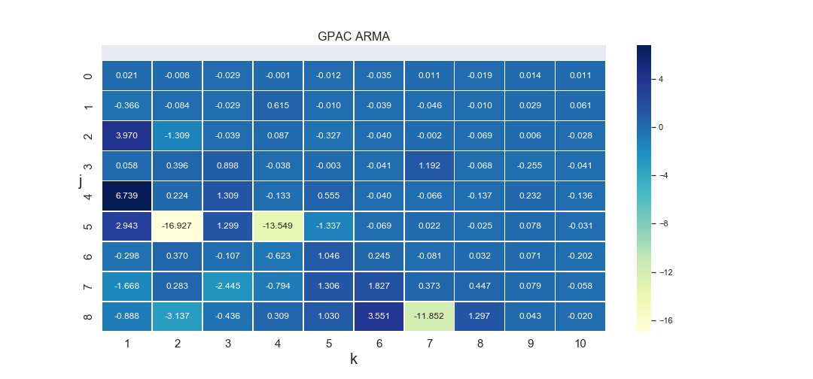

The following patterns are detected: 
- ARMA(3,0)
- ARMA(3,4)
- ARMA(5,6)
- ARMA(6,0)

Second method utilized to determine the order of ARMA is interpreting the ACF and PACF plots below. 

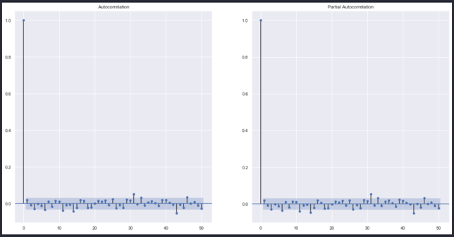

The PACF and ACF plots using statsmodels library show the shaded blue area which is the confidence intervals where the standard deviation is computed according to Bartlett’s formula \[2]. The plotted stems that protrude beyond the shaded area are indicators for the orders that can be used when fitting autoregressive (AR) and moving-average (MA) models. ACF can help determine the order of MA- here the plot shows that orders 3, 6 and 11 may be used. The PACF plot helps determine the order of MA, which could also shows them to be at lags 3, 6 and 11.  

 
Finally a GirdSearch-esque method is used to determine the best AR and MA orders. By fitting 42 models with j and k values ranging from 0-6 and 1-6 respecievly. The data used is the differenced Log of the training data. Criteria for selection of models will be matching GPAC table if possible, test the AR and MA parameters' confidence interval is significant (p-value < 0.05) and Box-Pierce's Q p-values greater than 0.05 (Hypothesis test is discussed in section 4.3 of this report). The zero/pole cancellation is then checked to determine the final list of orders that will be used to estimate the ARMA parameters. 

The condtions on the gs_arma_table below check which out of the 42 order combinations have all the Ar and Ma parameter p-values less than 0.05 and Q p-value greater than 0.05. 

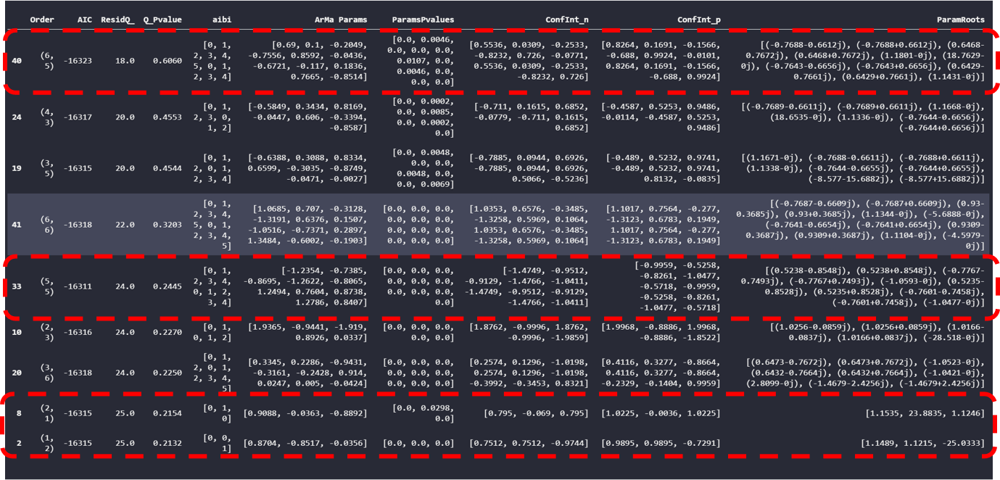

\* Table column names key:
*Order*: ARMA(na,nb) order; *AIC*: AIC of the model; *ResidQ* and *Q_Pvalue* are the residuals box-pierce Q and corresponding p-value; *ArMa Params* are ARMA parameters ordered as a1, a2,..,an,b1,b2,..,bn if na and nb are non-zero, these numberings are shown in column *aibi*; *ParamsPvalues*: ARMA parameters p-values in same order as ArMA Params column; *ConfInt_n* is lower limit of a parameter's confidence internval and *ConfInt_p* is the upper limit; and *ParamRoots* are the roots of the AR and MA systems. 

GPAC table and GridSearch agree on ARMA(3,4) as potential orders to model NASDAQ price with. I will additionally consider ARMA(2,1), ARMA(6,5) and ARMA(5,5) from GridSearch results. Below is zero/cancellation check for each of the patterns.  The table divides the roots of the same order number (min(ai,bi)/max(ai,bi)) upto the last parameter with the smaller order number. 

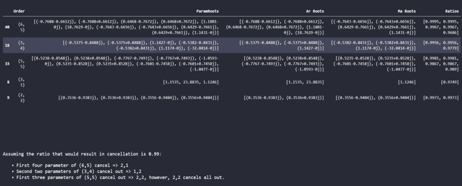

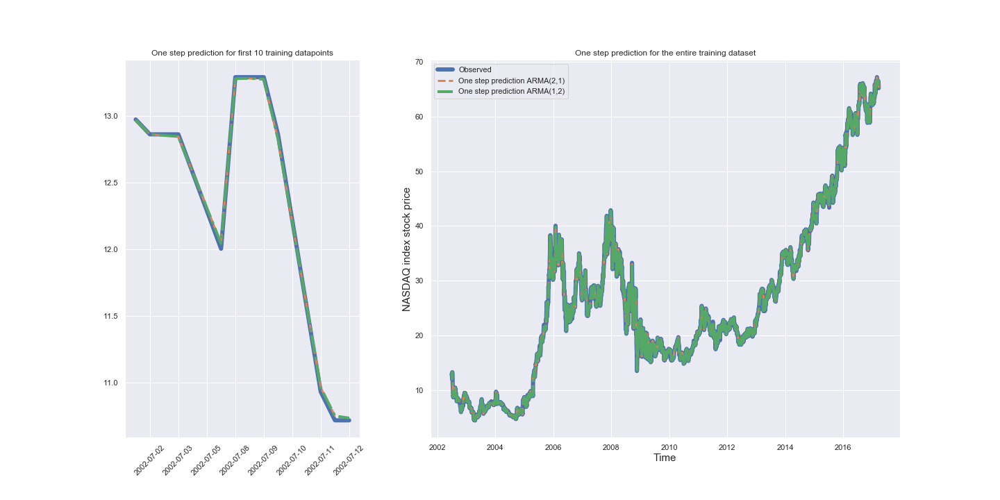

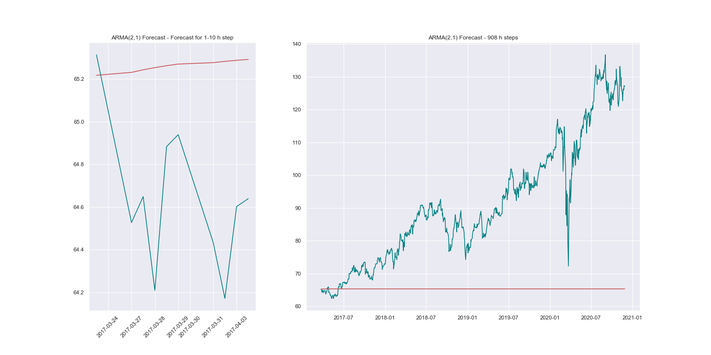

Method | Q-Value | Q p-value | Var Fore Er/Var Res | MSE Residuals | Mean of Residuals | MSE Forecast Errors |
-------|---------|-----------|---------------------|---------------|-------------------|-----------------------|
ARMA(1,2) | 26 | 0.15 | 507776 | 0.00 | 0.00 | 1011 |
ARMA(2,1) | 26 | 0.15 | 488152 | 0.00 | 0.00 | 1011 |

Both ARMA models residuals have Q p-values > 0.05 indicating the residuals are White Noise. This indicates the models are good at extracting the all of the information within the data. Also, the mean of residuals is very close to 0 indicating it the models are unbiased. However, both the MSE forecast errors and ratio of forecast to residual variances are very large indicating that the forecast capability of these models is weak. As such, an ARIMA model will be fitted to seek and improve the forecast results. Please refer to Appendix for a plot of the ARMA forecast using the manual loop method and the forecast method in the TSA library for comparision purposes. 

\* Table column names key:
*Order*: ARMA(na,nb) order; *AIC*: AIC of the model; *ResidQ* and *Q_Pvalue* are the residuals box-pierce Q and corresponding p-value; *ArMa Params* are ARMA parameters ordered as a1, a2,..,an,b1,b2,..,bn if na and nb are non-zero, these numberings are shown in column *aibi*; *ParamsPvalues*: ARMA parameters p-values in same order as ArMA Params column; *ConfInt_n* is lower limit of a parameter's confidence internval and *ConfInt_p* is the upper limit; and *ParamRoots* are the roots of the AR and MA systems. 

None of the fitted models has a case where all parameters p-values are below 0.05. The order that strikes the best balance in having low Q value and lowest possible p-values is order ARIMA(3,1,4). This order also matches one of the pattern in GPAC table. Final step is to make sure the roots of the parameters do not cancel out. The table divides the roots of the same order number (min(ai,bi)/max(ai,bi)) upto the last parameter with the smaller order number.

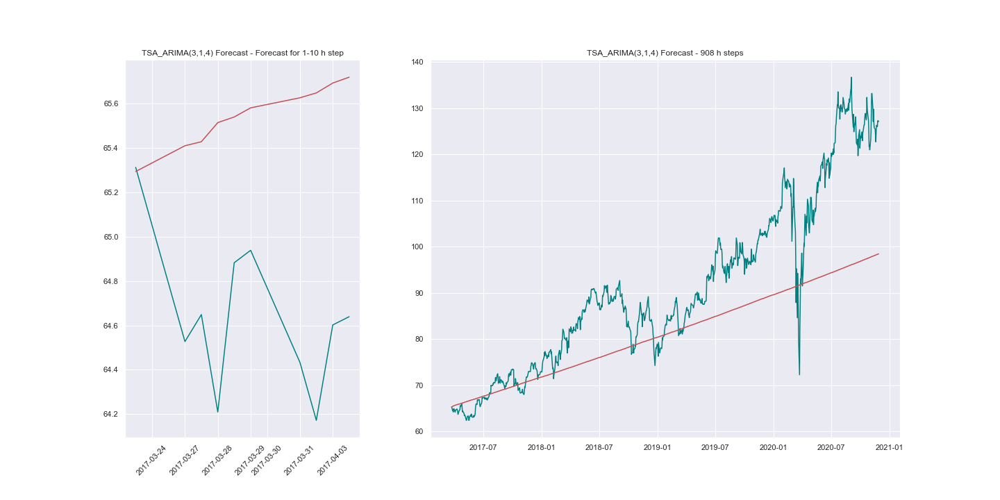

Method | Q-Value | Q p-value | Var Fore Er/Var Res | MSE Residuals | Mean of Residuals | MSE Forecast Errors |
-------|---------|-----------|---------------------|---------------|-------------------|-----------------------|
ARMA(3,1,4) | 23 | 0.26 | 268 | 0.39 | 0.00 | 199 |

Similar to ARMA models, the ARIMA model has successfully produced white noise residuals, near zero mean and low residual MSE. However, the forecast errors evaluated using the manual loop have higher MSE when compared to to ARMA model. However, using the forecast method in SARIMAX library produces nearly identical residual properties and statistics and better h-step forecast results. Below is the ACF plot for ARIMA314 residuals.

## Conclusion

The holt-linear method performed the best out of the baseline models in both predictions and forecasting.  

Both ARMA orders (1,2) and (2,1) performed well in one-step prediction resulting in WN residuals and unbiased models (mean of residuals close to 0), however, the forecasting capability was weak as it produced high forecast errors. The forecast plot indicated a very small increase in value from 65.22 to 65.32 in the first few steps, then it plateaued. A comparison between the TSA library and manual loop calculation was carried out in the appendix and the forecast results were very similar for both methods of forecasting. 

The ARIMA(3,1,4) model also performed well in one-step prediction, again, resulting in in WN residuals and unbiased model (mean of residuals close to 0). Using the TSA library forecast method, the forecast MSE is lower than ARMA. 

